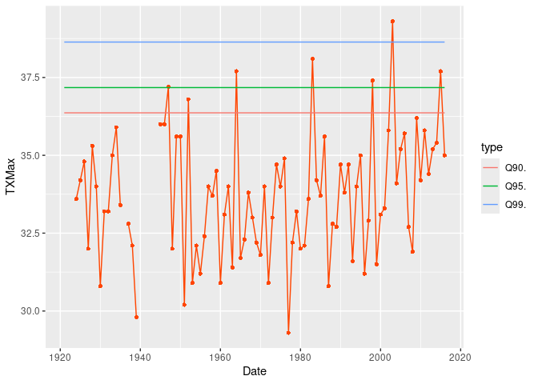
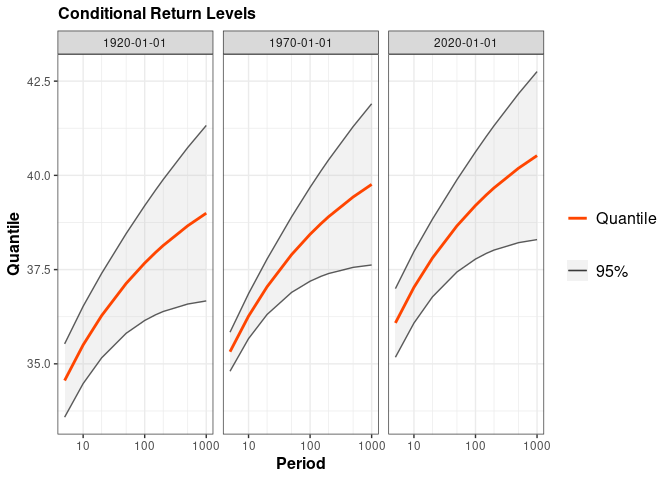
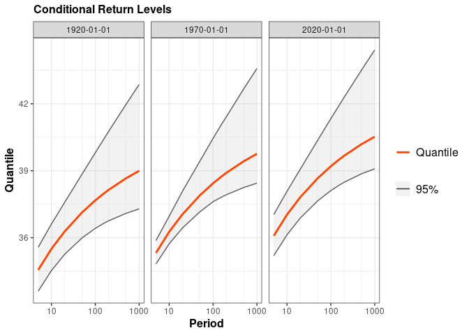
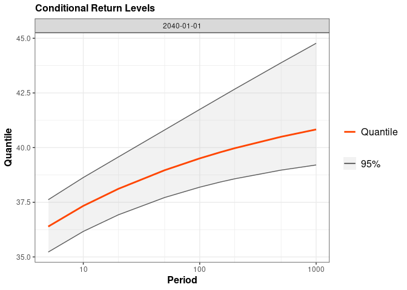
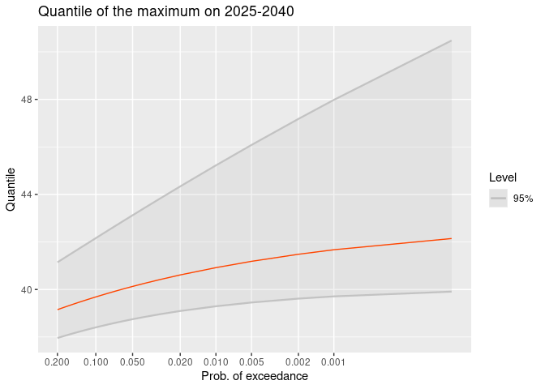

### NSGEV

The **NSGEV** R package is devoted to some Non-Stationary Extreme Value
models

The main function of the package is `TVGEV` which creates an object with
class `"TVGEV"` representing a Time-Varying model with GEV margins
depending on the time. This kind of model is especially useful to study
*block maxima*, usually annual maxima.

### Example

In this example we use the annual maxima of the daily maximal
temperature (TX) in Dijon (France) provided as the `TXMax_Dijon` data
frame

``` r
library(NSGEV)
head(TXMax_Dijon)
```

    ##   Year TXMax
    ## 1 1921    NA
    ## 2 1922    NA
    ## 3 1923    NA
    ## 4 1924  33.6
    ## 5 1925  34.2
    ## 6 1926  34.8

Note that the warnings and messages will not be shown in this example.

A TVGEV model requires a date variable beginnings of the annuela blocks

``` r
df <- within(TXMax_Dijon, Date <- as.Date(paste0(Year, "-01-01")))
fit0 <- TVGEV(data = df, response = "TXMax", date = "Date",
              loc = ~ 1)
coef(fit0)
```

    ##     mu_0  sigma_0     xi_0 
    ## 32.94616  1.87935 -0.19645

``` r
autoplot(fit0)
```

<!-- -->

We can fit a model with a linear time trend

``` r
fit1 <- TVGEV(data = df, response = "TXMax", date = "Date",
              design = polynomX(date = Date, degree = 1),
              loc = ~ t1)
autoplot(fit1)
```

<!-- -->

``` r
coef(fit1)
```

    ##        mu_0       mu_t1     sigma_0        xi_0 
    ## 32.93752186  0.01527735  1.84567285 -0.20471258

``` r
anova(fit0, fit1)
```

    ## Analysis of Deviance Table
    ## 
    ##      df deviance      W  Pr(>W)  
    ## fit0  3   364.74                 
    ## fit1  4   361.20 3.5412 0.05986 .
    ## ---
    ## Signif. codes:  0 '***' 0.001 '**' 0.01 '*' 0.05 '.' 0.1 ' ' 1

The `predict` method can be used to compute conditional return levels
corresponding to a given year, be it a past or future year

``` r
pred <- predict(fit1)
```

    ## Since 'object' is really time-varying, the Return Levels
    ## depend on the date. A default choice of dates is made here.
    ## Use the 'newdate' formal to change this.

``` r
autoplot(pred)
```

<!-- -->

``` r
autoplot(predict(fit1, confint = "proflik", trace = 0))
```

    ## Since 'object' is really time-varying, the Return Levels
    ## depend on the date. A default choice of dates is made here.
    ## Use the 'newdate' formal to change this.

<!-- -->

``` r
autoplot(predict(fit1, newdate = "2040-01-01", confint = "proflik", trace = 0))
```

<!-- -->

The default confidence intervals are obtained by using the “delta
method” but profile likelihood intervals can be otained as well.

Rather than considering the maximum on a specific block, one can
consider the maximum $M$ on a larger period as sometimes called a
*design life period*. The distribution of $M$ is then no longer a GEV

``` r
date <- as.Date(paste0(2025:2040, "-01-01"))
qm <- quantMax(fit1, date = date, confint = "proflik", trace = 0)
autoplot(qm) + ggtitle("Quantile of the maximum on 2025-2040")
```

<!-- -->

By changing the value of the `design` argument one can different use
basis functions such as splines with given knots.

## INSTALLATION

### With the *remotes* package

In an R session use

``` r
library(remotes)
install_github("IRSN/NSGEV", dependencies = TRUE)
```

This should install the package and make it ready to use.

Mind that by default this does not build the vignettes shipped with the
package (long-form documentation). To build the vignettes, use instead

``` r
install_github("IRSN/NSGEV", dependencies = TRUE, build_vignettes = TRUE)
```

The installation will then take more time but the vignettes will be
accessible from the help of the package (link above the “Help Pages”
section).

You can also select a specific branch or a specific commit by using the
suitable syntax for `install_github`. See the **remotes** package
documentation for more details.

### Precompiled versions

Precompiled versions of the package are available for some platforms and
can be downloaded by using the **Releases** link of the GitHub
Repository. Use `NSGEV_x.y.z.tgz` for MacOS, `NSGEV_x.y.z.tgz` for
Windows and `NSGEV_x.y.z_R_x86_64-pc-linux-gnu.tar.gz` for Linux Ubuntu
where `x`, `y` and `z` are the major, minor and patch numbers of the
package version.
