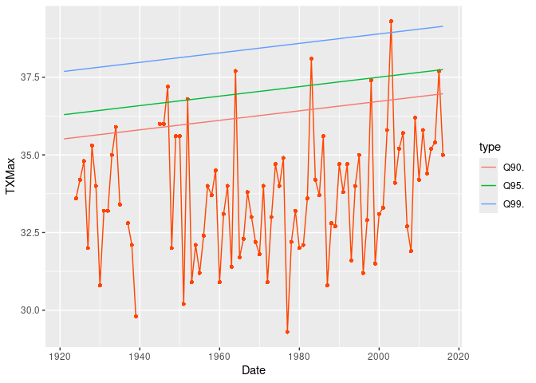

## NSGEV

The **NSGEV** R package is devoted to some Non-Stationary Extreme Value
models.

The main function of the package is `TVGEV` which creates an object with
class `"TVGEV"` representing a Time-Varying model with GEV margins
depending on the time. This kind of model is especially useful to study
*block maxima*, usually annual maxima. This kind of models could be used
with CRAN packages such as **extRemes**, yet **NSGEV** makes it easier
to cope with bases of functions. It also brings some new things such as
the profile likelihood confidence intervals on the return levels or on
the quantile of the maximum on an arbitrary period.

## Example

In this example we use the annual maxima of the daily maximal
temperature (TX) in Dijon (France) provided as the `TXMax_Dijon` data
frame. Note that the warnings and messages will not be shown in this
example.

The annual maxima in Celsius are given in in the column `TXMax`

``` r
library(NSGEV)
head(TXMax_Dijon)
#>   Year TXMax
#> 1 1921    NA
#> 2 1922    NA
#> 3 1923    NA
#> 4 1924  33.6
#> 5 1925  34.2
#> 6 1926  34.8
```

A `TVGEV` model requires a date variable indicating the beginnings of
the annual blocks. This variable can be easily created from the `Year`
variable

``` r
df <- within(TXMax_Dijon, Date <- as.Date(paste0(Year, "-01-01")))
fit0 <- TVGEV(data = df, response = "TXMax", date = "Date",
              loc = ~ 1)
coef(fit0)
#>     mu_0  sigma_0     xi_0 
#> 32.94616  1.87935 -0.19645
autoplot(fit0)
```

<!-- -->

We can fit a model with a linear time trend. A possibility is to use the
`polynomX` function that creates a basis of polynomial functions for a
given degree. This makes a variable `t1` available for the fit

``` r
fit1 <- TVGEV(data = df, response = "TXMax", date = "Date",
              design = polynomX(date = Date, degree = 1),
              loc = ~ t1)
autoplot(fit1)
```

<!-- -->

``` r
coef(fit1)
#>        mu_0       mu_t1     sigma_0        xi_0 
#> 32.93752186  0.01527735  1.84567285 -0.20471258
```

The `predict` method can be used to compute conditional return levels
corresponding to a given year, be it a past or future year. Since a
`TVGEV` object keeps trace of the design function(s) used the prediction
does not require a data preparation step. By default the “new” dates at
which the return levels are computed are those in the data frame used to
fit the model

``` r
pred <- predict(fit1)
autoplot(pred)
```

<!-- -->

``` r
autoplot(predict(fit1, confint = "proflik", trace = 0))
```

<!-- -->

``` r
autoplot(predict(fit1, newdate = "2040-01-01", confint = "proflik", trace = 0))
```

<!-- -->

The default confidence intervals are obtained by using the “delta
method” but profile likelihood intervals can be obtained as well by
using the `confintMethod` argument (possibly abbreviated as `confint` of
`conf`). Note that the `autoplot` method is to be used rather than the
`plot` method, because the \*\*ggplot2\* package is used.

Rather than the maximum on a specific block, one can consider the
maximum $M$ on a larger period as sometimes called a *design life
period*. The distribution of $M$ is then no longer a GEV but the its
quantiles can be computed with confidence intervals

``` r
date <- as.Date(paste0(2025:2040, "-01-01"))
qm <- quantMax(fit1, date = date, confint = "proflik", trace = 0)
autoplot(qm) + ggtitle("Quantile of the maximum on 2025-2040")
```

<!-- -->

By changing the value of the `design` argument one can different use
basis functions such as splines with given knots.

## INSTALLATION

### With the *remotes* package

In an R session use

``` r
library(remotes)
install_github("IRSN/NSGEV", dependencies = TRUE)
```

This should install the package and make it ready to use.

Mind that by default this does not build the vignettes shipped with the
package (long-form documentation). To build the vignettes, use instead

``` r
install_github("IRSN/NSGEV", dependencies = TRUE, build_vignettes = TRUE)
```

The installation will then take more time but the vignettes will be
accessible from the help of the package (link above the “Help Pages”
section).

You can also select a specific branch or a specific commit by using the
suitable syntax for `install_github`. See the **remotes** package
documentation for more details.

### Precompiled versions

Precompiled versions of the package are available for some platforms and
can be downloaded by using the **Releases** link of the GitHub
Repository. Use `NSGEV_x.y.z.tgz` for MacOS, `NSGEV_x.y.z.tgz` for
Windows and `NSGEV_x.y.z_R_x86_64-pc-linux-gnu.tar.gz` for Linux Ubuntu
where `x`, `y` and `z` are the major, minor and patch numbers of the
package version.
