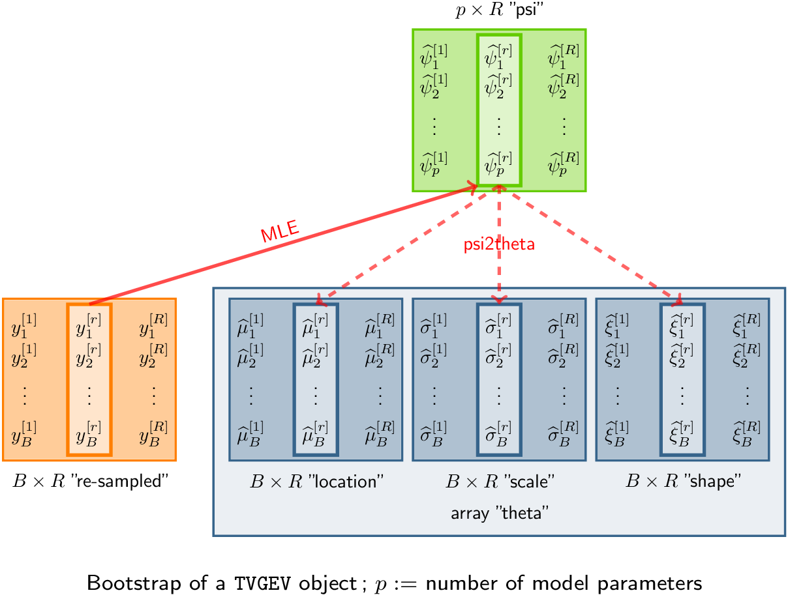

```{r global_options, include=FALSE}
library(knitr)
knitr::opts_chunk$set(
    cache = FALSE,
    fig.width = 6, fig.height = 4, fig.path = "Rgraphics/")
KABLE <- TRUE
library(NSGEV)
library(ismev)
```

		      
This document was created with **NSGEV** `r packageVersion("NSGEV")`.
		      
# Scope
	  
The **NSGEV** package provides a class of R objects representing
models for observations following a Time-Varying Generalized Extreme
Value (GEV) distribution, usually block maxima, as described in the
chapter 6 of the book by Coles [@Coles_ExtremeValues]. This class of
models is named `"TVGEV"`.  These models are specific Non-Stationary
GEV models: *only slowly varying functions of the time can be used as
covariates*. They can be fitted by using CRAN packages such as
**ismev** [@Rpack_ismev], **evd** [@Rpack_evd], **extRemes**
[@Rpack_extRemes] and more. However with these packages, the
particularities of the Time-Varying context are not taken into
account, and it is quite difficult for instance to compute
predictions. The `TVGEV` class and its methods have the following
features.

- Return levels are easily computed for a given time.
		
- The inference on return levels can be obtained by
  profile-likelihood, using a dedicated algorithm.

- The return level specific to the time-varying framework of Parey et
  al [@PareyEtAl_DifRetLev] can be computed as well as
  profile-likelihood confidence intervals on it.

- Graphical diagnostics favour the **ggplot** system
  [@RPack_ggplot2]. The `autoplot` and `autolayer` S3 methods
  are consequently used instead of the `plot` and `lines` S3 methods
  of the classical **graphics** package. 
    
The present vignette shows how models can be specified and fitted,
and illustrates the use of the principal methods. 

# A simple linear trend on the GEV location

## Data for illustration
     
We begin by using the dataset `TXMax_Dijon` shipped with the package.
   
```{r Dijon0}
head(TXMax_Dijon)
```

The data represent the annual maxima of the daily maximal temperature
(`TX`) in Dijon (France). The time series is shown on the next plot (R
code not shown). The data are provided by [European Climate Assessment
and Dataset](https://www.ecad.eu).
	
```{r Dijon0b, echo=FALSE, message=FALSE, warning=FALSE}
myBts <- as.bts(TXMax_Dijon, yearName = "Year")
autoplot(myBts) + ggtitle("Annual maxima of TX in Dijon")
 
```

The observations from 1980 on seem to be larger than that of the
beginning of the series, motivating the use of a time-varying model.
		

## Simple linear trend
   	
As a possible model, a time-varying block maxima model relates the
distribution of the response $Y_b$ for the block (year) $b$ to the
corresponding time $t_b$, assuming that the observations are
independent across blocks. We will assume here that $Y_b$ has a GEV
distribution with constant scale $\sigma$, a constant shape $\xi$ and
a time-varying location $\mu(t) = \mu_0 + \mu_1 t$. This model involves
a vector $\boldsymbol{\psi} := [\mu_0, \,\mu_1, \, \sigma, \, \xi]$ of four
unknown parameters.

 We can fit this model by using several CRAN packages, for instance
the **extRemes** package. With this package we need to exclude the
missing values for the response
   
```{r Dijon1a}
fite1 <- extRemes::fevd(x = TXMax,
                        data = subset(TXMax_Dijon, !is.na(TXMax)),
                        type = "GEV", location.fun = ~Year)
```

Note that a classical *formula* is used to specify the model as it is
done for linear models with `lm` or `glm`. By default, a formula implies
the use of a constant. So the formula `~ Year` indeed implies the
existence of the coefficient $\mu_0$ in $\mu(t) = \mu_0 + \mu_1 t$. We
could have used equivalently an explicit constant with `~ 1 +
Year`. On the contrary, a model with no constant $\mu(t) = \mu_1 t$
would have been specified by using the formula `~ Year - 1`. This
convention is used by most model fitting functions requiring a formula
in the linear model fashion, and `TVGEV` will be no exception.

By inspecting the content of the object or by reading the help, we can
find the estimated values of the parameters
     
```{r Dijon1b}
fite1$results$par
fite1$results$value
```

We see that the estimated location increases by about $100 \times
\widehat{\mu}_1 =$ `r round(100 * fite1$results$par[2], digits = 2)`
Celsius by century, with an intercept value $\widehat{\mu}_0 =$
`r round(fite1$results$par[1], digits = 2)` Celsius corresponding to the
year $0$. We extracted as well the negative maximized log-likelihood
stored in the element `results$value`.

	
To achieve nearly the same thing with the **NSGEV** package, we need a
little extra work: adding a column with class `"Date"` to the data
frame. Each observation of this date column represents the beginning
of a block. We can simply paste a month and day indication `-mm-dd` to
the year in order to get a POSIX format
   
```{r Dijon2}
df <- within(TXMax_Dijon, Date <- as.Date(paste0(Year, "-01-01")))
class(df$Date)
head(df$Date, n = 5)
```

Note that we no longer have to remove the observations with a missing
response. Now we can fit the same model
	
```{r Dijon3}
fitNLin <- TVGEV(data = df, response = "TXMax", date = "Date",
               design = polynomX(date = Date, degree = 1),
               loc = ~ t1)
coef(fitNLin)
logLik(fitNLin)
```

Note that we used a formula as before but now the covariate is a
function of the date which is computed by the design function, here
`polynomX`. The design function essentially returns a numeric matrix, the column of
which can be used as covariates. So the name of the covariates depend
on the design function used. This will be further explained later.
   	
The estimated parameters are nearly the same as before, except for the
first one - due to a different origin taken for the linear trend.
Indeed, the time origin for R Dates is `"1970-01-01"`.  The maximized
log-likelihood is extracted by using the `logLik` method which works
for many classes of fitted models.

The "fitted model" object has class `"TVGEV"`, and a number of classical
S3 methods with simple interpretation are implemented    

```{r Dijon4}
class(fitNLin)
methods(class = "TVGEV")
```

For example we can use the classical `confint` method to display
confidence intervals on the parameters

```{r Dijon5}
confint(fitNLin)
```

The results (by default based on the delta method) show that $0$ is
within the $95\%$ interval on the slope $\mu_1$, though being very
close to the lower bound. The confidence interval on the shape $\xi$
suggest that this parameter is negative.
     	    	
As is generally the case with the S3 class/methods system for R, *the
methods should be used by invoking the generic function*,
e.g. `confint`. However the help for the methods can be found by using
the "dotted" name such as `?confint.TVGEV`. A method implemented for a
specific class usually has specific arguments that are not found in
the generic. For instance, the `confint` method for the class
`"TVGEV"` has a specific `method` argument that allows choosing the
inference method, with the three choices `"delta"` (default), `"boot"`
and `"proflik"`.

## Stationary model with no trend

Quite obviously, we can fit a model with a constant trend by using the
relevant formula
       
```{r Dijon3a}
fitNConst <- TVGEV(data = df, response = "TXMax", date = "Date",
                   design = polynomX(date = Date, degree = 1),
                   loc = ~ 1)
coef(fitNConst)
```
Since the design function is not used when the three GEV parameters
are constant, we can use `TVGEV` without its `design` argument.
      
	
```{r Dijon3b}
fitNConst <- TVGEV(data = df, response = "TXMax", date = "Date")
coef(fitNConst)

```

Note however that we still require that the response *and the date*
are provided as columns of a data frame.

As a general rule, a time-varying model should always be compared to a
simpler model with three constant GEV parameters. For that aim, we can
perform a likelihood-ratio test, which is by convention attached to
the `anova` method in R.
   
```{r Dijon3c}
anova(fitNConst, fitNLin)

```

The $p$-value is `r ifelse(anova(fitNConst, fitNLin)[["Pr(>W)"]][2] >
0.05, "> 0.05", "< 0.005")`, so if we assume that there could be a
global linear trend on the location, we would  `r ifelse(anova(fitNConst, fitNLin)[["Pr(>W)"]][2] >
0.05, "accept", "reject")` the null
hypothesis $H_0: \mu_1 = 0$ at the $5\%$ level.

We can investigate different forms of trend, using different designs.

	   
# Designs and models

## Example: polynomial design
       
Now let us have a look at the design function `polynomX` which was
used before. We can call it using the date column of the data frame
`df` passed to the formal argument `date` of the function. 
      
```{r Design0}
X <- polynomX(date = df$Date, degree = 1)
class(X)
head(X)
```
	
The result is an object with class `"bts"`, inheriting from the class
`"matrix"`, with two columns. We guess that the column named `Cst` is
a column of ones as commonly used in linear regression, and that the
column `t1` is a linear trend in years with its origin set 49 years
after 1921-01-01, so near 1970-01-01. Note that a `TVGEV` model does
not need to use all the basis functions of the design: we did not use
the constant `Cst`, because a constant basis function is generated by
default when the formula is parsed.

The class `"bts"` describes objects representing block times series. It
is quite similar to the `"mts"` class of the **forecast** package. A few
methods are implemented for this class e.g. the `autoplot` method. To
illustrate this method, we  consider a different design function involving
broken line splines, namely the function `breaksX` 

```{r Design0b}
X <- breaksX(date = df$Date, breaks = "1970-01-01", degree = 1)
autoplot(X, facets = TRUE)
```

The basis functions are now splines with degree $1$. The first function
named `t1` is a linear function and for each "break" date given in
`breaks`, a broken line function is added to the basis.
	  
There are other design functions. These are consistently used in
`TVGEV` as follows.
	
## Using designs with `TVGEV`
   	
With `TVGEV`

- When the model is fitted, the data frame specified with the `data`
  formal argument *must contain a column giving the date of the
  beginning of each block*. The column name is specified by using the
  `date` formal argument of `TVGEV`.

- The date column is *passed to a design function* given in the
  `design` formal argument. The value of `design` is a call to the
  chosen function, using the chosen column of `data` as the `date` of
  the design function.

- The block maxima model is specified through *formulas linking the
  GEV parameters to the columns of the
  design matrix*.
	
- The fitted model object keeps track of the design function used and
  therefore can use it on a "new" period of time to make a prediction.
	
```{r DesignC0, echo=FALSE, out.width="80%"}
library(png)
img1_path <- "images/DesignC.png"
## img1 <- readPNG(img1_path, native = TRUE, info = TRUE)
include_graphics(img1_path)
```
    
## Broken line trend on the location

We can use the `breaksX` design function to specify a continuous
broken line form for the location $\mu(t)$.
  
```{r fitNBreak-1}
fitNBreak <- TVGEV(data = df, response = "TXMax", date = "Date",
               design = breaksX(date = Date, breaks = "1970-01-01", degree = 1),
               loc = ~ t1 + t1_1970)
coef(fitNBreak)
```

The location parameter now involves three parameters according to

$$
\mu(t) = \mu_0 + \mu_1 t + \mu_2  [t - t_0]_+
$$

where $x_+ := \max(0,\, x)$ is the "positive part" function and where
$t_0$ corresponds to the break point in time. Note that the slope of
the location $\mu(t)$ is given by $\mu_0$ before the break point, and
by $\mu_0 + \mu_1$ after that point. This corresponds to the two
estimated slopes in Celsius by century: $100 \times \widehat{\mu}_1 =$
`r round(100 * coef(fitNBreak)[2], dig = 1)` (before break) and $100
\times [\widehat{\mu}_1 + \widehat{\mu}_2] =$ `r round(100 *
sum(coef(fitNBreak)[2:3]), dig = 1)` (after).  Since $\mu_2$ represents
the change of slope, we could decide whether the change of slope is
significant or not by querying whether a confidence interval on
$\mu_2$ contains $0$ or not. Another solution based on `anova` is
described later.
	
To assess the change in the distribution of $Y_b$, many graphical
diagnostics can be produced with **NSGEV**. For instance we can use
the `quantile` method, which produces a `bts` block time-series that
can be autoplotted
   
```{r fitNBreak-2}
autoplot(quantile(fitNBreak, prob = c(0.95, 0.99, 1.00)))
```
	
Since the estimated value of the shape parameter $\xi$ is negative,
all the GEV distributions for the observations $Y_b$ are estimated as
having a finite upper end-point $\omega := \mu - \sigma / \xi$. We can
find this value by setting the probability to $1.0$ in the quantile
function. Remind that we use the *estimated* distribution, so the
shown upper end-point is the estimate $\widehat{\omega}_b$. We could
infer on the unknown value $\omega_b$ by using confidence intervals.
The value of $\omega_b$ is the return level (conditional on $t_b$)
corresponding to an infinite return period $T=\infty$.
      
	
The two models corresponding to the objects `fitNLin` and `fitNBreak` are
*nested*: by setting $\mu_2 = 0$ in the second model, we retrieve the
first one.  So we can perform a likelihood-ratio test as above.
	    

```{r fitNBreakanova}
anova(fitNLin, fitNBreak)
```

We see from the very small $p$-value labelled `Pr(>W)`
that the null hypothesis $\mu_2 = 0$ must be rejected in favour of a
break at the chosen break time as defended by `fitNBreak`.

A limitation of the `fitNBreak` model is that the break time can not be
estimated simply. The same problem arises for the Gaussian regression
known as *kink regression*. So we can try another basis of slowly
varying functions which is flexible enough to describe a smooth
transition between two linear trends with different slopes.
       
   
## Natural spline basis
      
As a third example of design, we will use the *natural spline* design as
implemented by `natSplineX`. With this design, we need to give two
boundary knots as well as a number of knots between the boundary knots.
Along with its flexibility, an interesting property of this basis is
that the extrapolation outside of the boundary knots is "only" linear.
By using polynomials of degree $2$, we would get a quadratic trend which
becomes unrealistic even for a small amount of extrapolation.

```{r fitNNS-design}
X1 <- natSplineX(date = df$Date, knots = "1970-01-01",
                 boundaryKnots = c("1921-01-01", "2017-01-01"))
autoplot(X1, facets = TRUE)
```
	
The basis functions are linearly independent but they span a linear
space which contains the constant $1$; in other words, if we add a
column of ones to `unclass(X1)` we get a matrix with four columns but
with rank $3$. So we can either use a constant and two of the basis
functions, or use the three basis function but *we then have to remove
the default constant* as follows.
    
```{r fitNNS-fit}
fitNNS <- TVGEV(data = df, response = "TXMax", date = "Date",
               design = natSplineX(date = Date, knots = "1970-01-01",
                   boundaryKnots = c("1920-01-01", "2017-01-01")),
               loc = ~ ns1 + ns2 + ns3 - 1)
```

As before the models corresponding to `fitNLin` and `fitNNS` are nested
because the basis functions used in `fitNLin` (the implicit constant $1$
and the linear function `t1`) both are in the linear space generated by
the natural spline basis. So we can use the `anova` method.
    	
	
```{r fitNNSanova}
anova(fitNLin, fitNNS)
```

Again we see that `fitNNS` fits the data significantly better than
`fitNLin` does. We can not compare the two models `fitNBreak` and `fitNNS` by
using `anova` because they are no longer nested. However since these
two models have the same number of parameters, using AIC or BIC would
conclude to a slight advantage in favour of `fitNNS` which has a
slightly smaller deviance, hence a slightly larger log-likelihood.

```{r BIC}
c("Breaks" = BIC(fitNBreak), "Natural Spline" = BIC(fitNNS))
```

## Possible numerical problems

A possible source of problems, the design matrices created by the
design functions can take large values. Indeed, a date is considered
as a number of days for a given origin; for a long series we will get
basis functions with values of several thousands or even much more
when polynomials with degree $>1$ are used. In order to facilitate the
task of maximizing the likelihood, it is worth using the `origin`
formal argument of the provided design functions, setting it to a date
close to the mean date of the series.

	
	 
# Return levels and quantiles

## Conditional return levels

With time-varying models or non-stationary models, the concept of
return level becomes quite messy, because many reasonable definitions
can be given. The simplest return levels are the *conditional* ones,
obtained by fixing a time $t$ and by considering the quantiles of the
fitted distribution for that specific time.

```{r fitNBreakpredict}
pBreak <- predict(fitNBreak)
autoplot(pBreak)
    
```
	
As suggested by the warning message, three "round" values are chosen
by default for the time $t$ and the return level plots are shown for
each of these in a specific facet of the plot. Note that the axis
could have used a probability of exceedance on a yearly basis rather
than a period in years. We can make a different choice by using the
`newdate` optional argument of `predict`, see `?predict.TVGEV`.

## Confidence Intervals
	  
Each of the return levels is computed with a confidence interval with
its default level set to $0.95$. By default, the delta method is used,
resulting in symmetrical confidence intervals.  Two alternative
methods can be used by setting the optional argument `confintMethod`:
profile-likelihood and bootstrap. With the profile-likelihood method,
a constrained optimization method is repeatedly used and convergence
diagnostics are printed by default. To save space we remove these
by setting the `trace` argument.
     
	  
```{r fitNBreakpredictPL}
pBreakPL <- predict(fitNBreak, confintMethod = "proflik", trace = 0)
plot(pBreakPL)
    
```

## Unconditional return levels

*Unconditional return levels* can be defined for the time-varying
framework. These are obtained by aggregating several times
corresponding to a prediction period. Many definitions are possible;
a natural requirement is that the usual definition continues to
hold when a stationary model is considered as time-varying.	      

Following Parey et al [@PareyEtAl_DifRetLev], we can define the return
level corresponding to $T$ years as the level $\rho$ such that the
number $N$ of exceedances over $\rho$ in the $T$ "next years" has unit
expectation $\mathbb{E}(N) = 1$. The notion of "next" year is relative
to a time origin that can be chosen.

```{r fitNBreakpredictUnCond}
pUCBreak <- predictUncond(fitNBreak, newdateFrom = "2020-01-01",
                          confintMethod = "proflik", trace = 0)
plot(pUCBreak)
kable(pUCBreak, digits = 2)
    
```

For instance the return level corresponding to $T=30$ years for the
origin `"2020-01-01"` should be exceeded once (on average) during the
ten years 2021 to 2050. This level is estimated here to be
`r round(subset(pUCBreak, Period == 30)$Quant, digits = 2)` Celsius.

Note that an alternative definition of the return level can be
implemented as a function $\rho(\boldsymbol{\psi})$ of the parameter
vector $\boldsymbol{\psi}$ of the model. Under quite general
conditions, such a return level can be regarded as a parameter of the
model in a re-parameterization of it, hence we can infer on it as we
do for a parameter. To achieve this in practice, the return level must
be implemented as a R function with signature `function(object, psi)`
where `object` has class `"TVGEV"` and `psi` stands for the parameter
vector. The `profLik` method can then be used to infer on the return
level using the profile-likelihood method, see `?profLik.TVGEV`. This
method can work for any smooth function having the previous signature.
		   
## Quantiles of the maximum
  
Rather than trying to generalize the definition of a return level to
the time-varying framework, one can simply consider the random maximum
$M^\star := \max_{b} Y_{b}$ where the maximum is over a set
$\mathcal{B}^\star$ of $n^\star$ blocks. The most common case is when
$\mathcal{B}^\star$ is a future period $b = b_0^\star + 1$, $\dots$,
$b_0^\star + n^\star$, such as the lifetime of an equipment, and one
want to assess a risk related to the possible exceedance over some
high level during this period. Since the blocks are assumed to be
independent we have

$$
   F_{M^\star}(m^\star;\,\boldsymbol{\psi}) 
   = \prod_{b \in \mathcal{B}^\star} 
    F_{\texttt{GEV}}(m^\star;\,\boldsymbol{\theta}_{b}) \qquad \text{for all }
	m^\star,
$$
    
where the dependence on the parameter $\boldsymbol{\psi}$ is through
$\boldsymbol{\theta}_b(\boldsymbol{\psi})$. Note that in general
$M^\star$ does not follow a GEV distribution.

The corresponding quantile function $q_{M^\star}(p)$ can be computed
numerically either by solving $F_{M^\star}(q) = p$ or by interpolating
from couples of values *probability*, *quantile* $[p_i,\,q_i]$. For a
given probability $p$, the derivative of the corresponding quantile
w.r.t. $\boldsymbol{\psi}$ can be obtained by the implicit function
theorem and can be used to infer on the quantile.


In **NSGEV**, the `quantMax` method can be used to produce a table of
values for the quantile function from a `TVGEV` object. Such a table
is given the S3 class `"quantMax.TVGEV"` for which an `autoplot`
method has been implemented

```{r quantMax1}
newDate <- as.Date(sprintf("%4d-01-01", 2025:2054))
qM <- quantMax(fitNBreak, date = newDate, level = c(0.70, 0.95))
gqM <- autoplot(qM) +
    ggtitle("Maximum on years 2025-2054 with delta confidence intervals")
print(gqM)
```

The plot shows the quantile $q_{M^\star}(p)$ against the probability
of exceedance $1 -p$ using a Gumbel scale. So if $M^\star$ happens to
be Gumbel (as can happen in the stationary case) the quantile line
will be a straight line. When the period of interest
$\mathcal{B}^\star$ is increased the maximum becomes stochastically
larger. For instance, with a fixed beginning if the duration $n^\star$
of the period is increased the maximum $M^\star$ becomes
stochastically larger: all quantiles are increased.

It is worth noting that as far as a small probability of exceedance
$\bar{p} := 1 -p$ is concerned, the expected value of the random
number $N$ of exceedances over the corresponding quantile is
$\mathbb{E}[N] \approx \bar{p}$. This approximation is acceptable when
$\bar{p} < 0.05$.

**Note** At the this time, only confidence intervals based on the
delta method can be computed.

# Simulate from a fitted model

The `simulate` method is implemented in many R packages, with the aim
to simulate new data from a given model. It has been implemented for
the `TVGEV` class. A fitted model object can be used to simulate new
paths either for the fitting time period or for a new one.
    
```{r simulate1}
autoplot(simulate(fitNBreak, nsim = 100))
```
	
We can use a different period to better understand how the
model anticipates new data		
	
```{r simulate2}
nd <- seq(from = as.Date("2020-01-01"), length = 10, by = "years")
autoplot(simulate(fitNBreak, nsim = 10, newdate = nd))
```

The simulated paths are here drawn in colour with a legend because
their number is small enough. Note that `simulate` is functionally
close to a prediction: the mean of a large number of simulated paths
is close to the expectation used in a prediction and the uncertainty
on the prediction can be assessed by using the dispersion of the
simulated paths.


# More diagnostics and results
	  
## Residuals

The generalized residuals are random variables $e_b$ related to the
observations $y_b$, so they form a block time-series. The distribution
of $e_b$ should be nearly the same for all blocks $b$ and the
dependence between the blocks should be weak. Several definitions of
the residuals are possible, in relation with their target
distribution. A simple choice is $e_b := F_{\text{GEV}}(y_b;\,
\widehat{\boldsymbol{\theta}}_b)$ which should lead nearly to a
uniform distribution on the interval $(0,\,1)$ [@PanagouliaEtAl_NonStationaryGEV].  The inverse
transformation is $y_b = q_{\text{GEV}}(e_b;\,
\widehat{\boldsymbol{\theta}}_b)$. When the GEV marginal distributions
have a nearly exponential tail $\xi \approx 0$ using the standard
exponential distribution for the generalized residuals can be
preferred because this will use a milder transformation of the data. This is
the default choice. 

```{r resid, warning=FALSE}
autoplot(resid(fitNBreak))
```

The horizontal lines show an interval with approximate probability
$95\%$.  The use of these residuals is similar to that in the usual
linear regression framework where the distribution of the standardized
residuals is close to the standard normal.

## Parameters: "psi" $\boldsymbol{\psi}$ vs "theta" $\boldsymbol{\theta}$

As shown before the parameters of the model can be extracted by using
the `coef` method. Using a non-standard terminology which seems
specific to the package, we can say that these are the "psi"
parameters. But we can be interested as well by the GEV parameters
$\mu$ , $\sigma$ and $\xi$ that we can call "theta"
$\boldsymbol{\theta}= [\mu,\, \sigma, \,\xi]$. Since these parameters
depend on the time $t$ we can consider them as forming a block time
series. We can "extract" these parameters by using the optional formal
`type` of the `coef` method; this leads to a `bts` object that can be
autoplotted. Remind that the physical dimensions of the parameters
differ - $\mu$ and $\sigma$ have the dimension of the $Y_b$ while
$\xi$ is dimensionless - so we have better show each series in a facet
with its own $y$ axis.

```{r fitNBreakthetas}
thetas <- coef(fitNBreak, type = "theta")
autoplot(thetas, facets = TRUE)
```
  

	     
## Marginal distributions

Several methods can be used to assess the marginal distribution of
$Y_b$ for a specific time $t_b$ or at a collection of times given by a
`date` argument. With the default `date = NULL`, the methods
`quantile`, `mean`, `moments` for the class `"TVGEV"` return time
series objects that can be "autoplotted" to plot the quantiles or the
mean (expectation) against the date as it was shown
before. The help page with examples can be displayed in the usual way, e.g.
with `?quantile.TVGEV`.

	
The `density` and `cdf` methods both return a functional time series:
a collection of functions depending on the date. These can be
autoplotted as well.
    
```{r fitNBreakDens}
autoplot(density(fitNBreak), fill = TRUE)
```
        
If needed, the time series with class `"bts"` can be coerced into a
standard time series inheriting from `"ts"` for which many methods
have been written in different packages.    


 
# Bootstrap

## Principle
   
A large number $R$ of response vectors $\mathbf{y}^{[r]}$ are
simulated or "re-sampled" corresponding to $r=1$, $\dots$, $R$. These
simulated values can be stored into a matrix with $B$ rows and $R$
columns. For each vector $\mathbf{y}^{[r]}$, the MLE
${\widehat{\boldsymbol{\psi}}}^{[r]}$ of the "psi" parameter vector
$\boldsymbol{\psi}$ is computed. The sample quantiles of the
${\widehat{\boldsymbol{\psi}}}_i^{[r]}$ can then be used to provide a
confidence interval on $\psi_i$.

The `bs` method takes a `TVGEV` object as its first argument and
computes the bootstrapped "psi" parameters
$\widehat{\boldsymbol{\psi}}^{[r]}$. These bootstrapped parameters are
in fact stored as the rows of the `estimate` element of the returned
list.
					 
```{r boostrap}
myBoot <- bs(fitNBreak)      
names(myBoot)
head(myBoot$estimate, n = 3)
```
	
Note that the default number of replicates `R` is very small and has
been set for a purely illustrative use. A well-accepted choice
$\geqslant 3000$.

```{r BootC0, echo=FALSE, out.width="80%"}

```
	
It is easy to derive from the theta parameters the corresponding block
times series of "thetas"
$\widehat{\boldsymbol{\theta}}_b^{[r]}$. Broadly speaking we have to
apply the function `psi2theta` to each line of the matrix returned as
the `estimate` element of the result.
	 
```{r boostrap1}
mu <- apply(myBoot$estimate, MARGIN = 1,
            FUN = function(x, model) psi2theta(psi = x, model = model)[ , 1],
            model = fitNBreak)
autoplot(bts(mu, date = fitNBreak$fDate)) + ggtitle("bootstrapped values for mu")
```
	
One the bootstrapped values for the "psi" parameters have been
computed, they can be used to later infer on the return periods
at a short computing cost. In that aim, a new element named `boot`
must be added to the fitted model.
 	 
```{r boostrap1a, eval = FALSE}
fitNBreak$boot <- myBoot
```    

Note however that this is a kind of "hack". Some care is needed to
ensure that the new `boot` element is consistent with the right fitted
model using the right data.

Since most modern computers use multicore processors, a parallel
computation can be used to achieve substantial saving in the computing
time. See the example in the help page of `boot.ts` to see how this
can be achieved.
     
## Details how resampling is performed
     
Two methods can be used to "resample" $\mathbf{y}$ [@PanagouliaEtAl_NonStationaryGEV]

- **Parametric**. For $r=1$, $\dots$, $R$, the value $y_b^{[r]}$ is
  drawn as $y_b^{[r]} \sim
   \text{GEV}(\widehat{\boldsymbol{\theta}}_b)$ where
    $\boldsymbol{\theta}_b$ is the MLE of the vector of the three
    GEV parameters corresponding to the block $b$, which is a function
    of $\boldsymbol{\psi}$.

- **Non-parametric**. For $r=1$, $\dots$, $R$, the generalized
 residuals $e_b$ are resampled to form a vector $\mathbf{e}^{[r]}$
 with the wanted size $B$. Each residual $e_b^{[r]}$ is
 back-transformed to a response $y_b^{[r]} := q_{\text{GEV}}(e_b^{[r]};\,
 \widehat{\boldsymbol{\theta}}_b)$.

The second method is also known under the names *fixed-$t$ resampling*
and *resampling from the residuals*.

The bootstrap $\widehat{\boldsymbol{\psi}}^{[b]}$ can also be used to
infer on the return levels, either conditional or unconditional. For
example, the conditional return level $\rho_b(m)$ corresponding the
the period of $m$ blocks and for the given time $t_b$ can be inferred by using the
quantiles of the return periods which are computed as $q_{\text{GEV}}(p;
\,\widehat{\boldsymbol{\theta}}_b^{[r]})$ for $p:= 1 - 1/T$.
  					  

# Strengths and limitations of `TVGEV`

The `"TVGEV"` S3 class and its dedicated methods allow a simple use of
time-varying GEV models, including prediction. Some functionality of
the package such as the simulation are not found in more classical
packages, to our best knowledge. However
		  
1. Only known functions of time $x(t)$ can be used as covariates.

2. Each of GEV parameters can only depend on the time covariates
  through a linear function of these.
  
3. The parameters $\psi$ can not be share across GEV parameters.

To illustrate 1., we can not use a binary variable indicator of a site
  in order to build a regional model. To illustrate 2., the GEV
  location $\mu$ can be $\psi_1 x_1(t) + \psi_2 x_2(t)$ but not have
  the form $x(t)^\psi$. To illustrate 3., we can not have both $\mu(t)
  = \psi_0 + \psi_1 x(t)$ and $\sigma(t) = \psi_3 \mu$, because the
  parameters $\psi_1$ and $\psi_2$ are then used both by the location
  $\mu$ and the scale $\sigma$.
	  	  

					  
# Appendix
					  
## Coping with dates
   
In practice, the time will be represented by a *date* object, and the
POSIX format `"yyyy-mm-dd"` or in R `"%Y-%m-%d"` will be favored. The
R **base** package has a `"Date"` class which is used by **NSGEV**

```{r date}
myDate <- as.Date("2020-01-01")
class(myDate)
myDate
format(myDate, "%d %B %Y")
```
	
```{r date1}
myDate <- seq(from = as.Date("1980-01-01"), by = "years", length = 40)
x <- runif(length(myDate))
plot(myDate, x, type = "o", xlab = "")
                         
```


	
The **lubridate** package [@pack_lubridate] has functions that can
help to cope with date.
				  

## Adding new design functions

You can add new design functions. A design function:
    
- Must have its first argument named `date`. This argument is intended
  to be passed either as an object with class `"Date"` or as an object
  which will be coerced automatically to this class by using
  `as.Date`.  For instance, a character vector in POSIX format should
  work.

- Must return a matrix with the basis function as its columns. It must
  also have an attribute named `"date"` containing the date vector.
  This object should be created either by using the `bts` function
  (creator for the class) or by simply giving the class `c("bts", "matrix")`
  to a matrix with the suitable attribute.

## Estimating the break with a broken line trend

Let us consider again the broken line trend discussed above,
namely
	
$$
\mu(t) = \mu_0 + \mu_1 t + \mu_2  [t - t_0]_+.
$$
	
As mentioned before, the date $t_0$ of a change of slope can be
considered as an unknown parameter, but the model then no longer has
the form for `TVGEV` objects, so it can no longer be estimated by
using directly the `TVGEV` function. Yet we can find the value of
$t_0$ by maximizing the log-likelihood over a vector of candidate
values: estimating a `TVGEV` model for each value will provide
the corresponding log-likelihoods. For a given year we can create a
suitable formatted date with the `sprintf` function as follows
   
```{r kink1}
yearBreaks <- c(1940, 1950, 1955, 1960:2000, 2005, 2010)
res <- list()

for (ib in seq_along(yearBreaks)) {
    d <- sprintf("%4d-01-01", yearBreaks[[ib]])
    floc <- as.formula(sprintf("~ t1 + t1_%4d", yearBreaks[[ib]]))
    res[[d]] <- TVGEV(data = df, response = "TXMax", date = "Date",
                      design = breaksX(date = Date, breaks = d, degree = 1),
                      loc = floc)
}
```

We now have a list `res` of `length(yearBreaks)` objects and the
log-likelihood of each object can be extracted by using `logLik`. So
we can plot the log-likelihood against the year and find the "best"
object with maximal log-likelihood.

     	
```{r kink2}
ll <- sapply(res, logLik)
plot(yearBreaks, ll, type = "o", pch = 21, col = "orangered",
     lwd = 2, bg = "gold", xlab = "break", ylab = "log-lik")
grid()
iMax <- which.max(ll)
abline(v = yearBreaks[iMax])
abline(h = ll[iMax] - c(0, qchisq(0.95, df = 1) /2),
       col = "SpringGreen3", lwd = 2)
```	

Although the points show a profiled log-likelihood, the regularity
conditions that must hold in ML estimation are not fulfilled, because
the log-likelihood is not differentiable w.r.t. $t_0$. As a
consequence, the usual level (shown as the lower horizontal line in green
here) does not provide a confidence interval on the unknown $t_0$.
    
## Constraints on the parameters, fixed parameters
   
As an experimental feature, inequality constraints on the parameters
$\psi_i$ can be imposed. The constraints are simple "box" constraints
of the form $\psi^{\text{L}}_i \leqslant \psi_i \leqslant
\psi^{\text{U}}_i$ where $\psi^{\text{L}}_i$ and $\psi^{\text{U}}_i$
are given. These constraints can only be used when the likelihood is
maximized with the `nloptr` package.  If needed, they can be given for
some parameters only, letting the other bounds fixed at their default
values $\psi^{\text{L}}_i = -\infty$ and $\psi^{\text{U}}_i = \infty$.

In practice, the constraints are given by using a named vector,
and hence the names of the parameters must be known. These
names can be retrieved if needed by first using `estim = "none"`.

```{r constr}     
fitNBreak2 <-
    TVGEV(data = df, response = "TXMax", date = "Date",
          design = breaksX(date = Date, breaks = "1970-01-01", degree = 1),
          loc = ~ t1 + t1_1970,
          estim = "nloptr",
          coefLower = c("xi_0" = -0.15), coefUpper = c("xi_0" = 0.0))
coef(fitNBreak2)
```	
         
The GEV shape parameter $\xi$ is usually taken as constant, not
time-varying; inasmuch the log-likelihood is $\infty$ when $\xi < -1$,
a lower bound $\psi^{\text{L}}_i > -1$ should normally be set. In
practice, this is usually not needed because for numerical reasons the
optimization will converge to a local maximum with $\xi > -1$ and a
finite log-likelihood rather than to a parameter vector with the
infinite maximal log-likelihood.
      
The constraints can be used to set a parameter to a given value
$\psi_i^\star$ by taking $\psi^{\text{L}}_i := \psi_i^\star$ and
$\psi^{\text{U}}_i := \psi_i^\star$.

```{r constr2} 		       
fitNBreak3 <-
    TVGEV(data = df, response = "TXMax", date = "Date",
          design = breaksX(date = Date, breaks = "1970-01-01", degree = 1),
          loc = ~ t1 + t1_1970,
          estim = "nloptr",
          coefLower = c("mu_t1" = -0.02, "xi_0" = -0.2),
          coefUpper = c("mu_t1" = -0.02, "xi_0" = 0.1))
coef(fitNBreak3)
```

# References
